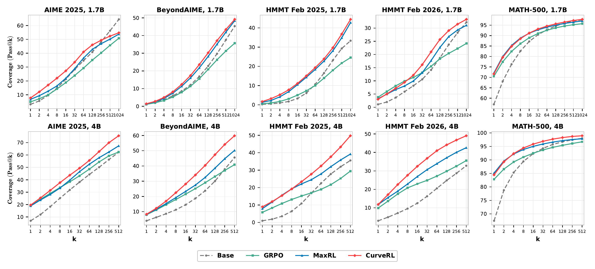

<h1 align="center">
CurveRL: Principled Distribution-Aware Context Reweighting for LLM Reasoning
</h1>

<div align="center">
  <a href="#"></a> &nbsp;
  <a href="https://github.com/zhyzmath/CurveRL"></a> &nbsp;
  <a href="#"></a> &nbsp;
</div>

<p align="center">
  <a href="#overview">📖 Overview</a> &nbsp;·&nbsp;
  <a href="#key-contributions">🏆 Key Contributions</a> &nbsp;·&nbsp;
  <a href="#method">📖 Method</a> &nbsp;·&nbsp;
  <a href="#main-results">📊 Main Results</a>
  <br>
  <a href="#getting-started">🚀 Getting Started</a> &nbsp;·&nbsp;
  <a href="#acknowledgements">🤝 Acknowledgements</a> &nbsp;·&nbsp;
  <a href="#citation">🔗 Citation</a>
</p>

<a id="overview"></a>
## 📖 Overview

Context-level reweighting has emerged as a central algorithmic lever in **Reinforcement Learning with Verified Rewards (RLVR)** for improving the reasoning capability of large language models, yet the principle determining what constitutes an *optimal* weighting remains poorly understood. CurveRL addresses this gap from two angles:

- **A unified optimality framework.** We cast prompt reweighting as **context distribution control** and formulate the optimal weight as a *functional derivative* of a utility functional defined in the pass-rate function space. This subsumes existing pointwise schemes — REINFORCE, GRPO, MaxRL — as special cases.
- **A distribution-aware instantiation.** Pointwise weights are determined solely by the absolute value of the pass rate $\hat{p}$, and so suffer from a *weight collapse*: in the early stage most prompts have $\hat{p} \approx 0$ and in the late stage most prompts have $\hat{p} \approx 1$, yielding nearly indistinguishable weights. CurveRL replaces this with a **quantile coordinate transform**, in which the weight depends not on the absolute value of $\hat{p}$ but on its **rank and density** in the evolving pass-rate distribution.

<a id="key-contributions"></a>
## 🏆 Key Contributions

- We formulate prompt reweighting in RLVR as **context distribution control** and define optimal weights through utility-dependent *functional derivatives* in pass-rate function space.
- We instantiate this principle with a **distribution-aware utility in pass-rate quantile space**, yielding CurveRL, which characterizes the rank and density structure of the evolving pass-rate distribution.
- We run extensive experiments showing that CurveRL improves the **pass@1 / pass@k Pareto frontier** over GRPO and MaxRL across multiple math reasoning benchmarks on Qwen3-1.7B-Base and Qwen3-4B-Base, and we analyze the underlying mechanism.


<a id="method"></a>
## 📖 Method

### Distribution-aware utility in quantile space

CurveRL applies a **quantile coordinate transform** through a reference CDF $F_{\mathrm{ref}}$ with density $f_{\mathrm{ref}}$, giving the utility

$$\mathcal{U}_\theta(F_{\mathrm{ref}}) \;=\; \mathbb{E}_{x \sim d_0}\!\left[\psi\!\left(F_{\mathrm{ref}}(p_\theta(x))\right)\right]$$

with the **log distortion** $\psi(u) = \log u$, corresponding to a risk-seeking preference that emphasizes hard prompts. The induced gradient yields the CurveRL weight

$$w(\hat{p}) \;=\; \frac{f_{\mathrm{ref}}(\hat{p})}{F_{\mathrm{ref}}(\hat{p})}$$

which has the form of a **reverse hazard rate**: $1/F_{\mathrm{ref}}(\hat{p})$ emphasizes the *lower-quantile* prompts, while $f_{\mathrm{ref}}(\hat{p})$ makes the allocation **data-driven** by tracking pass-rate regions that are actually populated under the current policy.


### Algorithm

At each training step $t$, we estimate $F_{\mathrm{ref}}$ and $f_{\mathrm{ref}}$ from a **lagged** sliding window $W$ that stores the active pass rates from the last $t_0$ batches. Concretely:

1. **Weight estimation.** For each grid point $p \in \\{1/N, 2/N, \dots, (N-1)/N\\}$, evaluate $\hat{f}_{\mathrm{ref}}(p)$ and $\hat{F}_{\mathrm{ref}}(p)$ from $W$ via a histogram estimator.
2. **Gradient estimation.** For each prompt $x$ in the current batch, draw $N$ rollouts, compute the empirical pass rate $\hat{p}$. If $\hat{p} \in (0, 1)$, set the per-rollout advantage to $w_t(\hat{p}) \cdot (r_i - \hat{p})$ with $w_t(\hat{p}) = \hat{f}_{\mathrm{ref}}(\hat{p}) / \hat{F}_{\mathrm{ref}}(\hat{p})$, and append $\hat{p}$ to $W$.
3. **Window update.** Evict pass rates older than $t - t_0$, keeping a length-$t_0$ window. The reference distribution remains lagged (built from previous batches only).


<a id="main-results"></a>
## 📊 Main Results

We train **Qwen3-1.7B-Base** and **Qwen3-4B-Base** on POLARIS-53K (≈50K math reasoning prompts) under the `verl` framework. All methods share the same training loop and differ only in the prompt-weighting rule. We use batch size $|\mathcal{B}| = 256$, $N = 8$ rollouts per prompt, and $t_0 = 10$.

CurveRL is compared against **GRPO** and **MaxRL** on five benchmarks in the main paper — AIME 2025, BeyondAIME, HMMT 02/25, HMMT 02/26, MATH-500 — and three more in the appendix (BRUMO 2025, HMMT 11/25, Minerva).

<p align="center">
  
  <br>
  <em>Figure 1 — pass@$k$ scaling on five representative benchmarks. CurveRL outperforms GRPO and MaxRL across the full range of $k$ on both model sizes, and exceeds the pretrained base model on most panels.</em>
</p>

**Key findings.**

- **Improved Pareto frontier of pass@$1$ and pass@$k$.** CurveRL attains the highest pass@$64$ on every benchmark across both model sizes, improving the average pass@$64$ by **+5.9%** on Qwen3-1.7B-Base and **+9.7%** on Qwen3-4B-Base over MaxRL — the strongest baseline — without sacrificing average pass@$1$.
- **Wider gap at larger $k$.** Against MaxRL, CurveRL's advantage *grows* with both model scale and $k$, reaching roughly **+7.3%** on HMMT 02/26 at $k = 1024$ on Qwen3-1.7B-Base and **+26.8%** on HMMT 02/25 at $k = 512$ on Qwen3-4B-Base — evidence that distribution-aware reweighting effectively broadens the search over reasoning trajectories.
- **No pass@$k$ degradation.** While GRPO and MaxRL exhibit varying degrees of pass@$k$ degradation relative to the pretrained base model, CurveRL exceeds the base model in 9 out of 10 panels above.


<a id="getting-started"></a>
## 🚀 Getting Started

### 1. Installation

The paper experiments use Python 3.10, CUDA 12.8, and 8× NVIDIA B200. Other recent CUDA / Ampere / Hopper GPUs should also work.

```bash
conda create -n curverl python=3.10 -y
conda activate curverl

pip install -r requirements.txt

pip install --no-deps -e .
```

### 2. Data preparation

The paper trains on POLARIS-53K and evaluates on eight math reasoning benchmarks. Build the parquet files once:

```bash
# Training data
python examples/curverl_data_preprocess/polaris.py     --local_dir data/polaris

# Benchmarks reported in the paper
python examples/curverl_data_preprocess/aime25.py      --local_dir data/aime25
python examples/curverl_data_preprocess/beyondaime.py  --local_dir data/beyondaime
python examples/curverl_data_preprocess/hmmt2502.py    --local_dir data/hmmt2502
python examples/curverl_data_preprocess/hmmt2602.py    --local_dir data/hmmt2602
python examples/curverl_data_preprocess/math_500.py    --local_dir data/math_500
python examples/curverl_data_preprocess/brumo25.py     --local_dir data/brumo25
python examples/curverl_data_preprocess/hmmt2511.py    --local_dir data/hmmt2511
python examples/curverl_data_preprocess/minerva.py     --local_dir data/minerva
```

### 3. Training

The launcher reads from environment variables and dispatches a single `verl.trainer.main_ppo` job.

```bash
# CurveRL (paper default: t_0 = 10)
ADVANTAGE_ESTIMATOR=curverl \
CURVERL_POOL_NUM=10 \
MODEL_PATH=Qwen/Qwen3-1.7B-Base \
bash qwen3_experiments/run_qwen3_training.sh
```

For Qwen3-4B-Base, set `MODEL_PATH=Qwen/Qwen3-4B-Base`.

### 4. Baselines

```bash
# GRPO
ADVANTAGE_ESTIMATOR=grpo  MODEL_PATH=Qwen/Qwen3-1.7B-Base \
  bash qwen3_experiments/run_qwen3_training.sh

# MaxRL
ADVANTAGE_ESTIMATOR=maxrl MODEL_PATH=Qwen/Qwen3-1.7B-Base \
  bash qwen3_experiments/run_qwen3_training.sh
```

### 5. Evaluation

The same launcher runs in val-only mode through a thin wrapper:

```bash
EVAL_DATASET=aime25 \
CKPT_PATH=/path/to/local/hf_model \
bash qwen3_experiments/run_qwen3_eva.sh
```


<a id="acknowledgements"></a>
## 🤝 Acknowledgements

This work builds on top of [`verl`](https://github.com/volcengine/verl) (Ray + Hydra + FSDP + vLLM) and the [`maxrl`](https://github.com/tajwarfahim/maxrl) baseline. We thank both projects for their open-source contributions.


<a id="citation"></a>
## 🔗 Citation

If you find CurveRL useful, please cite:

```bibtex
@article{curverl2026,
  title   = {CurveRL: Principled Distribution-Aware Context Reweighting for LLM Reasoning},
  author  = {Sun, Ke and Zhao, Yizhou and Xin, Jiayi and Long, Qi and Su, Weijie},
  journal = {arXiv preprint},
  year    = {2026},
}
```
